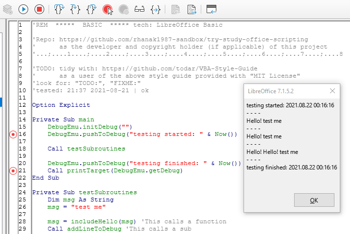

# try-study-office-scripting
[MPL-2.0 License] test repo (for) study and use office application scripts | LibreOffice Basic and/or MSO VBA

## About
Not much to see here as long as the project is still in its infancy.

## Tech Stack
 * LibreOffice Basic
 * 

## Legal
* See the [main License of this repo](./LICENSE)
* Please check out the [general notes and warnings](https://rhanak1987-sandbox.github.io/hello-world/possible-license-concerns.html) and use it as a guideline, as if the file was placed into this project
* Please use common sense, act with good intentions AND due diligence

###### fin
